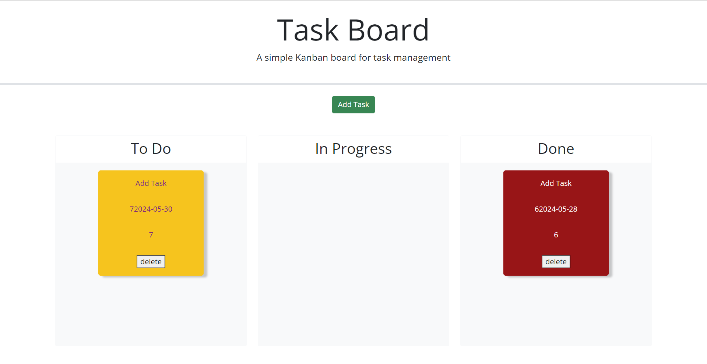

# Homework-05 Taskboard

Welcome to the repository for week-05's homework assignment.  This assignment largely utilized javascript and third party APIs (notably JQuery) wuth some basic HTML and CSS to add functionality to my taskboard.  

## Features

Form Submission: When I click 'Add Task' a pop-up with three fields displays: task, date and task description.

Local Storage: When the form is completed a task is added to the local storage, allowing you to access them even after the browser is closed.

Color-coded Tasks: Tasks that are due today (class 'warn') are given the background color yellow, while tasks (class 'late) that are past due are given a red background color.

Draggable Tasks:  Tasks are able to be dragged between three different containers in columns: To-do, In Progress, and Done.

Delete button: Each task has a delete button that when clicked will remove the task from the browser and local storage, which means when it is deleted it will not remain on the page after refreshing or closing the browser.

## Author

This project was conducted by me, Brad Schneider, a large portion of this challenge was already completed for some reason in the REPO, but I added the finishing touches to make it meet the acceptance criteria.

## License

This REPO uses MIT License